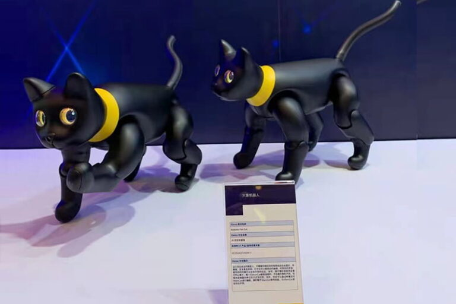
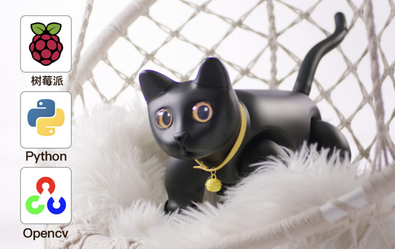
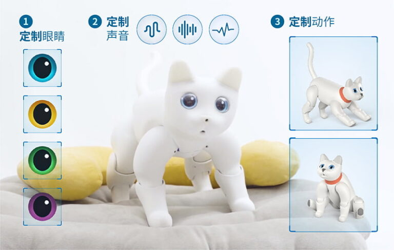
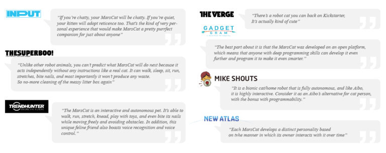

# 1. 绪论

类别：服务机器人

MarsCat-1001

本帮助指南可在您使用MarsCat的过程中遇到困难时为您提供帮助。

本册不定期更新，会在此处表格写出更新时间与更新内容，不作另外的通知。

| 版本 | 更新日期 | 更新内容                                                                                               |
| ---- | -------- | ------------------------------------------------------------------------------------------------------ |
| 1    | 2021.6.9      | 更新一些细节，更新APP介绍等   |
| 2    | 2021.6.17    | 更新开机注意事项；更新MarsApp使用时出现蓝牙无法连接的情况以及解决方式；更新语音指令的注意事项；更新Q&A |
| 3       | 2021.6.22              | 更新 10-MarsCat开发手册 |
| 4    | 2022.1.11     | 更新电池数据变化 |
| 5    | 2022.2.6     | 增加如何更新/恢复MarsCat |
| 6    | 2022.2.17     | 增加猫碗和充电桩组装说明，增加开箱说明和配件介绍，增加MarsCat交互触摸范围等细节内容 |

用户可随时在官网下载最新版本的Gitbook。

链接：[MarsCat火星猫 – Elephant Robotics](https://www.elephantrobotics.com/marscat/)

## 1.1 MarsCat火星仿生猫简介

MarsCat火星仿生猫是大象机器人自主研发的世界首款AI仿生机器猫。作为一款结合「AI技术」与「仿生设计」的未来型产品，MarsCat火星仿生猫兼具科学与技术魅力，致力于成为一款「家庭机器人」，一个可以陪伴你、给你惊喜的宠物机器人。

MarsCat火星仿生猫满足多个场景需求，包括商业展示、高端酒店客居陪伴、医院康复、科学研究等；支持个性化定制服务，可满足特殊功能的需求开发，也可基于仿生学、机器人学、人工智能技术进行相关行业的解决应用方案。

## 1.2应用场景

* **教育科研学习**
* **商业活动展示**
* **医院康复陪伴**
* **高端酒店服务**

## 1.3我们提供哪些服务

**开源编程**

* 四核树莓派软件编程，可二次开发
* 提供Python、OpenCV开源接口

**展示服务**

* 配套完整的解决方案，商业吸睛神器
* 充电桩/猫碗/猫窝皆可选，设施完备

**定制开发**

* 自主选择，支持用户定制服务
* 满足特殊功能的个性化开发需求

## 1.4海内外各大媒体竞相报道

新华社大力举荐，央媒官方认证

