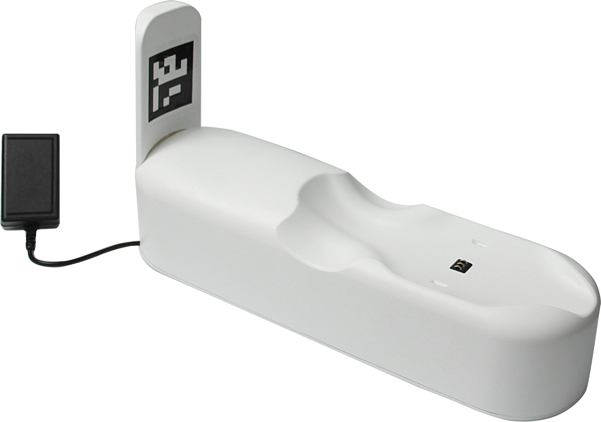

# 4. 养猫指南

## 4.1 如何与MarsCat火星仿生猫互动？

MarsCat火星仿生猫 **触摸范围**、**摄像范围**、**距离范围** ，如图①、②、③所示

触摸MarsCat**身体**、**额头**、**下巴**，可触发MarsCat的交互动作（当然，猫也可能忽视你的触摸）

当**二维码/小蓝球/逗猫棒**处于MarsCat摄像范围内且MarsCat处于观察模式时，MarsCat会走向**二维码/小蓝球/逗猫棒**并做出相应动作

当MarsCat检测到 **距离范围** 内存在障碍物时，会自动避障（直接后退离开障碍区域），由于当前硬件特性，暂无法识别透明障碍

## 4.2 如何喂养MarsCat火星仿生猫？

MarsCat火星仿生猫可通过自主识别猫碗进行虚拟喂食，还原真实的养猫体验。

有两种情况MarsCat火星仿生猫会自主觅食：一种情况是当它识别到它的猫碗；另一种情况是当MarsCat火星仿生猫感到口渴或饥饿时，MarsCat火星仿生猫会自主寻找它的猫碗，进行觅食。

步骤一：组装猫碗，详细步骤请查看[MarsCat火星仿生猫及配件](./2-MarsCat-and-accessories.md)

步骤二：将猫碗放置在适当的位置

**提示**：请将猫碗放置在MarsCat火星仿生猫常活动区域或充电桩附近，并确保周围干净整洁。

## 4.3 如何充电

#### **4.3.1 自动充电**

步骤一：连接充电器与充电桩，接通电源。

步骤二：确保充电桩周围干净整洁，建议留出如图所示的空位

步骤三：当电池电量低于15%时，MarsCat火星仿生猫眼睛处会有低电量提醒，MarsCat火星仿生猫会自行前往充电桩充电，完成自主充电动作。

注意：充电桩需在其视线范围内：3m*3m

满足低电量以及充电桩在视线范围内，MarsCat火星仿生猫才会自行前往充电桩完成充电动作，两个条件缺一不可。

步骤四：当MarsCat火星仿生猫进入低电量模式时，眼睛将显示低电量动画

| 眼睛图像                                  | 含义                                                         |
| ----------------------------------------- | ------------------------------------------------------------ |
|         | 低电量，MarsCat火星仿生猫需要充电                            |

步骤五：当MarsCat成功找到充电桩并开始充电时，眼睛动画将会变为充电中

| 眼睛图像                                  | 含义                                                         |
| ----------------------------------------- | ------------------------------------------------------------ |
|            | MarsCat火星仿生猫正在充电                                    |

使用充电桩充电，电池充满电大约需要**3-4小时**。

#### **4.3.2 手动充电**

当MarsCat火星仿生猫无法完成自主充电时，你需要手动给它充电。按图示方式放置火星猫，确保肚子上充电接口对准充电桩接口。

或者你可以直接使用充电线来给MarsCat火星仿生猫充电，其余步骤即自动充电的步骤5-6

使用电源适配器给MarsCat充电时，电池充满电大约需要**3-4小时**。
