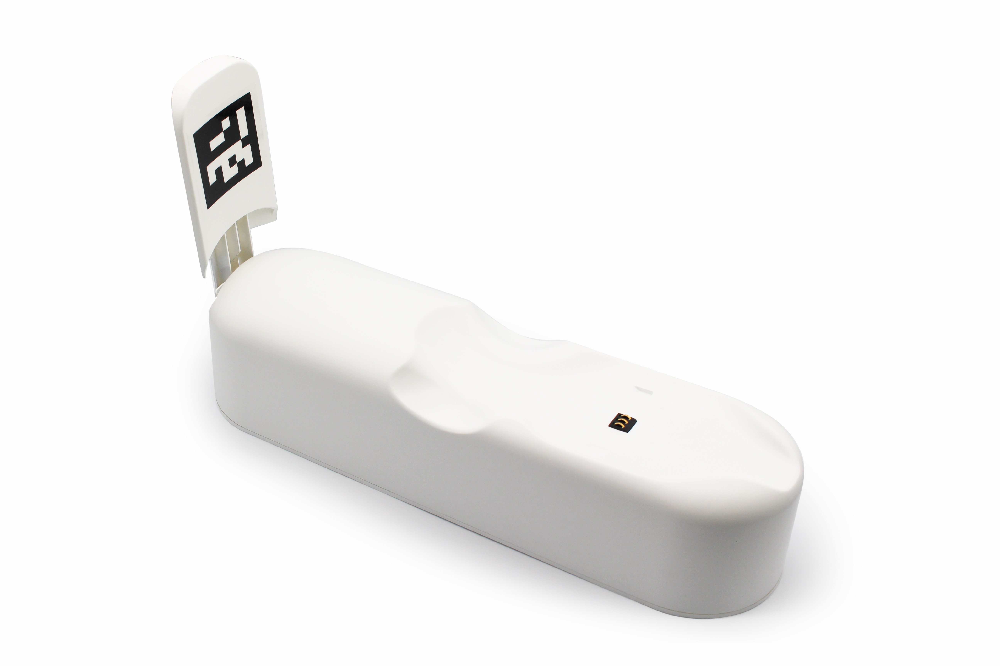

# 2.MarsCat火星仿生猫及配件

## 2.1 MarsCat火星仿生猫

**结构图解**

**产品参数**

| 名称          | MarsCat火星仿生猫                                                                                                                                                      | 接口          | Type-C(数据传输)， DC JACK（充电线接口），HDMI |
| ------------- | ---------------------------------------------------------------------------------------------------------------------------------------------------------------------- | ------------- | ---------------------------------------------- |
| **型号**     | MARS-1001                                                                                                                                                              | **通讯**     | 蓝牙                                           |
| **使用年龄** | 12+                                                                                                                                                                    | **耗能**     | 20W                                            |
| **关节**     | 16【头部：2；腿：4（腿）×3（关节）；尾巴：2】                                                                                                                         | **电池**     | 7.2V，6.7Ah                              |
| **材质**     | 塑料+玻璃+橡胶                                                                                                                                                         | **续航时间** | 活跃运动2小时，常规运动3-4小时                 |
| **颜色**     | 白，黑，灰，姜黄                                                                                                                                                       | **充电**     | 充电桩/充电器；8.4V/2A（Max）                  |
| **尺寸**     | 躺下：388（L）×268（W）×240（H）无尾巴 578（L）×268（W）×240（H）有尾巴 站立：372（L）×200（W）×329（H）无尾巴 503（L）×200（W）×329（H）有尾巴 | **充电时长** | 4-6小时                                        |
| **重量**     | 2.9KG                                                                                                                                                                  | **配件**     | Type-C USB, 4个可更换的爪垫                    |
| **微处理器** | 树莓派3B（wifi），四核开发板A53 CPU， 1GB存储器                                                                                                                        | **玩具**     | 小蓝球                                  |
| **显示器**   | 20LED（猫眼），128*128px，1.5英寸                                                                                                                                      |               |                                                |
| **摄像头**   | 5M Pixel摄像头，72度                                                                                                                                                   |               |                                                |
| **扬声器**   | 1个扬声器，1个麦克风                                                                                                                                                   |               |                                                |
| **感应器**   | 电容式触摸传感器                                                                                                                                                       |               |                                                |
| **开关**     | 1个电源开关                                                                                                                                                            |               |                                                |

## 2.2 充电桩

**注意事项**

1. 为了确保MarsCat火星仿生猫能在充电桩上自行对电池充电（自充电）并自主离开充电桩，请勿在充电桩周围放置任何可能干扰MarsCat火星仿生猫活动的物体。
2. 选择没有阳光直射的明亮房间放置充电桩，且避免将其放置在35°C（95°F）或更高的室温下。
3. 请勿裸手触摸充电接口，以免造成接触不良。
4. 请勿对充电桩施加外力，例如，按压或踩踏充电桩。
5. 请勿将充电站裸露在水中或其他液体中。

**产品参数**

| 电源供应 | 8.4V                      |
| -------- | ------------------------- |
| 输出电压 | 8.4V                      |
| 充电时间 | 3-5小时                   |
| 工作温度 | 5°C-35°C（41°F-95°F） |
| 尺寸     | 360×100×177（cm）       |
| 重量     | 1.27kg                    |

## 2.3 充电器

**注意事项**

1. 将附带的充电器与充电桩一起使用。使用提供的充电器以外的任何充电器都有可能会导致MarsCat火星仿生猫出现故障。
2. 请将充电器连接至易于操作的充电器插座。
3. 如果充电过程中MarsCat火星仿生猫出现任何问题，请立即拔下电源线，切断电源。
4. 为避免充电器发热或发生其他故障，请在充电完成后及时拔掉充电器。
5. 随附的充电器专为MarsCat火星仿生猫的充电桩设计，不得与其他任何电子设备一起使用。

**产品参数**

| 输入电压 | 220V            |
| -------- | --------------- |
| 输出电压 | 8.4V 2A         |
| 充电时长 | 大约3-5小时     |
| 尺寸     | 8×5×3.5（cm） |
| 工作温度 | 5℃-35℃        |
| 线长     | 1m              |

## 2.4 猫碗

当你收到货物时，拆箱后请将猫碗组装成如图所示的样子。

**注意事项**

1. 为了确保MarsCat火星仿生猫能准确识别猫碗，请勿在猫碗周围放置任何可能干扰MarsCat火星仿生猫活动的物体。
2. 请选择没有阳光直射的明亮房间放置猫碗。
3. 请勿对猫碗施加外力，例如，按压或踩踏猫碗。

## 2.5 玩具

你可以使用以下玩具与MarsCat火星仿生猫进行互动

- 小蓝球（提供）

专为MarsCat火星仿生猫提供。当MarsCat火星仿生猫看到小蓝球时，MarsCat火星仿生猫可能会靠近小蓝球，并做出扑球或者踢球的动作。

