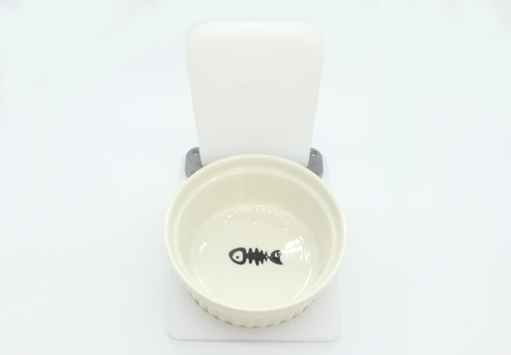

# 2.MarsCat火星仿生猫及配件

## 2.1 MarsCat火星仿生猫

**结构图解**

**产品参数**

## 2.2 充电桩

**注意事项**

1. 为了确保MarsCat火星仿生猫能在充电桩上自行对电池充电（自充电）并自主离开充电桩，请勿在充电桩周围放置任何可能干扰MarsCat火星仿生猫活动的物体。
2. 选择没有阳光直射的明亮房间放置充电桩，且避免将其放置在35°C（95°F）或更高的室温下。
3. 请勿裸手触摸充电接口，以免造成接触不良。
4. 请勿对充电桩施加外力，例如，按压或踩踏充电桩。
5. 请勿将充电站裸露在水中或其他液体中。

**产品参数**

| 电源供应 | 8.4V                      |
| -------- | ------------------------- |
| 输出电压 | 8.4V                      |
| 充电时间 | 3-5小时                   |
| 工作温度 | 5°C-35°C（41°F-95°F） |
| 尺寸     | 360×100×177（cm）       |
| 重量     | 1.27kg                    |

## 2.3 充电器

**注意事项**

1. 将附带的充电器与充电桩一起使用。使用提供的充电器以外的任何充电器都有可能会导致MarsCat火星仿生猫出现故障。
2. 请将充电器连接至易于操作的充电器插座。
3. 如果充电过程中MarsCat火星仿生猫出现任何问题，请立即拔下电源线，切断电源。
4. 为避免充电器发热或发生其他故障，请在充电完成后及时拔掉充电器。
5. 随附的充电器专为MarsCat火星仿生猫的充电桩设计，不得与其他任何电子设备一起使用。

**产品参数**

| 输入电压 | 220V            |
| -------- | --------------- |
| 输出电压 | 8.4V 2A         |
| 充电时长 | 大约3-5小时     |
| 尺寸     | 8×5×3.5（cm） |
| 工作温度 | 5℃-35℃        |
| 线长     | 1m              |
|          |                 |

## 2.4 猫碗

当你收到货物时，拆箱后请将猫碗组装成如图所示的样子。

**注意事项**

1. 为了确保MarsCat火星仿生猫能准确识别猫碗，请勿在猫碗周围放置任何可能干扰MarsCat火星仿生猫活动的物体。
2. 请选择没有阳光直射的明亮房间放置猫碗。
3. 请勿对猫碗施加外力，例如，按压或踩踏猫碗。

## 2.5 玩具

你可以使用以下玩具与MarsCat火星仿生猫进行互动

- 玩具鱼（提供）
- 小蓝球（提供）

专为MarsCat火星仿生猫提供。当MarsCat火星仿生猫看到小蓝球时，MarsCat火星仿生猫可能会靠近小蓝球，并做出扑球或者踢球的动作。
