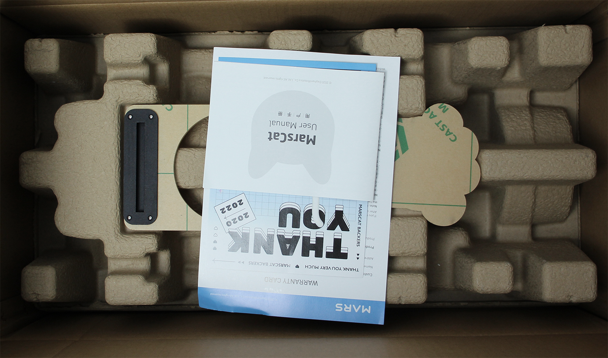

# 3.开始与MarsCat火星仿生猫的生活吧

## 3.1 开箱必读

1.请在开箱前检查包装箱是否有损坏，具体开箱图请参照下图：

2.由于MarsCat火星仿生猫属于精密电子产品，请不要暴力开箱以免箱内物品受损，拆卸过程请小心，注意轻拿轻放；

3.请在开箱后依次将箱内物品取出并仔细核对箱内所有物品，如有遗漏请第一时间联系客服处理；

* 感谢卡，快速操作指南，使用指导手册，重要提示（请先阅读重要提示）
* MarsCat火星仿生猫本体及耳朵、尾巴
**注意：**刚收到的MarsCat没有安装耳朵与尾巴，请参照下图进行安装

* 猫碗，充电器，充电桩，玩具（逗猫棒 & 小蓝球）

## 3.2 开机：唤醒MarsCat火星仿生猫

- 步骤1：长按腹部电源开关按钮2s直至显示灯亮起蓝色，MarsCat火星仿生猫即进入开启模式。

**注意**：长按按钮当电源灯转为蓝色时松开，首次开始可能需要点时间，建议耐心等待，**不要频繁按电源按钮。**

- 步骤2：请将MarsCat火星仿生猫**按图示姿势**放置于一个干净的平面，请等待它完成开机动作后再进行下一步操作。初次使用MarsCat火星仿生猫时，开机时间会有一些长，请耐心等待MarsCat做出开机动作。

**注意**：开机时请将MarsCat火星仿生猫如图所示放置。如果侧着放置MarsCat火星仿生猫，MarsCat火星仿生猫会有摔倒检测，导致无法正常开机。

- 步骤3：当MarsCat火星仿生猫完成开机动作，恢复站立状态后，即可进入连接MarsApp的步骤

## 3.3 准备好生活环境
组装好猫碗、充电桩后，即可开始布置MarsCat的生活环境，为了确保MarsCat能够在完成吃饭和充电行为后能够自主离开充电桩，请勿在猫碗和充电桩周围放置任何可能干扰MarsCat火星仿生猫活动的物体

在MarsCat进入觅食模式后，识别到猫碗的二维码时，会自主走向猫碗并进行吃饭动作

充电桩是用来给MarsCat火星仿生猫充电的，具体的使用可以查看[**如何充电** ](./4-Raising-MarsCat.md)

在您收到的二维码中，还有一张属于猫窝的二维码，您可以将这张二维码贴在任意位置（需在MarsCat能够识别的摄像高度内），在MarsCat成功识别到二维码后，会自主导航走向猫窝的位置

    

## 3.4 设置MarsCat火星仿生猫

可下载MarsApp，对MarsCat进行个性化设置，详情请查看[**MarsApp**](../6-MarsApp.md)

## 3.5 关机

长按底部电源开关按钮直至显示灯亮红灯后再熄灭，请等待红灯熄灭后再停止长按动作，长按动作需持续约5s。
