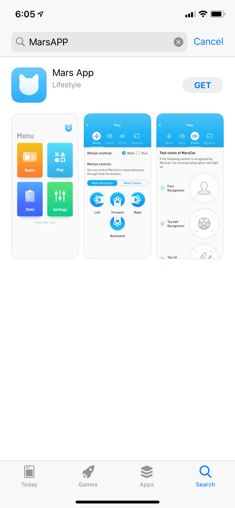
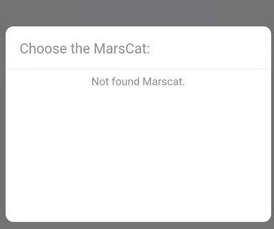
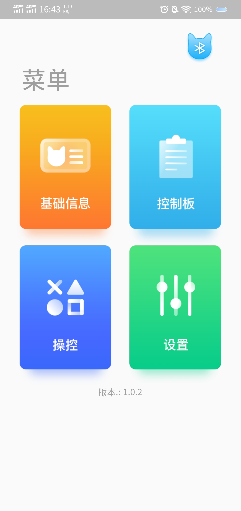
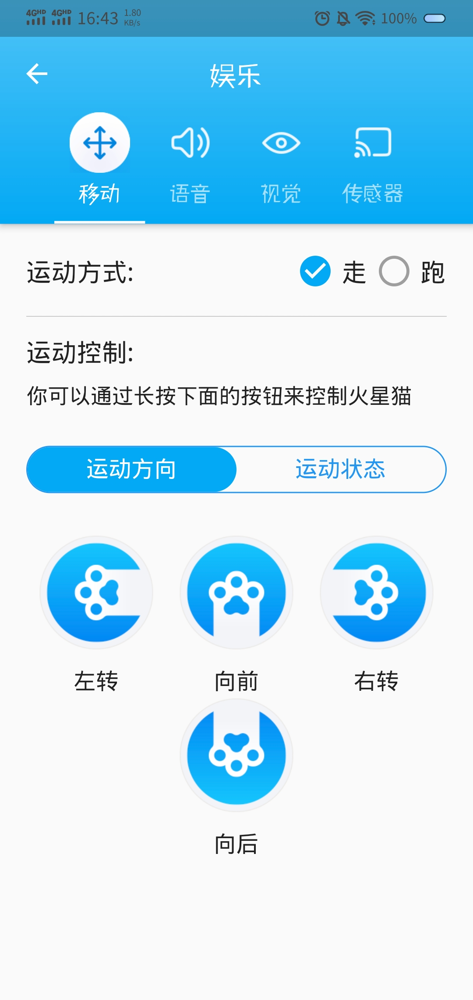
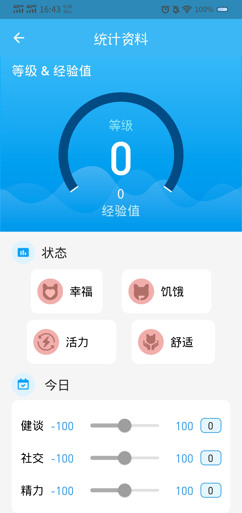

# 6.MarsApp

## 6.1 应用简介

MarsApp是针对于MarsCat火星仿生猫专门研发的应用程序，您可以通过MarsAPP更好地与MarsCat火星仿生猫互动，了解其成长，帮助您更舒适地享受MarsCat火星仿生猫的生活。

**安装**

安装MarsApp到你的手机上

1.官网下载：[MarsCat – Elephant Robotics](https://www.elephantrobotics.com/en/mars-en/)

你可以在官网找到

2.在苹果的应用商店-APPLE STORE搜索marscat/MarsApp

**版本支持**

适用于智能手机的Mars App应用程序支持的操作系统

语言支持

- 中文
- 英文

**联机设置**

打开APP--点击蓝牙连接--选择你要连接的MarsCat火星仿生猫

* 搜索成功，页面显示“连接”点击即可；
* 搜索失败，页面显示“没有搜索到火星猫”

如果连接失败，请重新连接或检查你的蓝牙以及MarsCat火星猫的状态。

**软件更新**

可在官网下载新版本软件、或者在应用商店中更新。

**蓝牙无法连接**

请判断是下列情况中的哪一种，并使用对应的解决方案

1.搜索不到猫的蓝牙信号

**解决方法**：重启猫&重装MarsApp

2.停留在蓝牙连接页面无法打开蓝牙

**解决方法**：App首次使用的时候，会弹出一个请求权限框；更新App后，是否有看到请求权限框，如果没有的话，请在后台给App开下权限重新试一下

## 6.2 如何使用MarsApp

跟随屏幕指导使用MarsApp设置MarsCat火星仿生猫

**P1：了解各项基本参数，拥有更多个性化设置**

您可以通过【基础信息】

* 设置MarsCat火星仿生猫眼睛颜色
* 设置MarsCat火星仿生猫性别
* 设置MarsCat火星仿生猫睡眠时间

**P2：实时记录动态数据，追踪成长轨迹**

您可以通过【统计资料】

* 了解MarsCat火星仿生猫等级&经验值
* 了解MarsCat火星仿生猫状态
* 了解MarsCat火星仿生猫日常指数

**P3：解锁与MarsCat火星仿生猫游戏互动**

您可以通过【操控】

* 控制MarsCat火星仿生猫移动
* 检查MarsCat火星仿生猫语音
* 检查MarsCat火星仿生猫视觉
* 检查MarsCat火星仿生猫传感器
